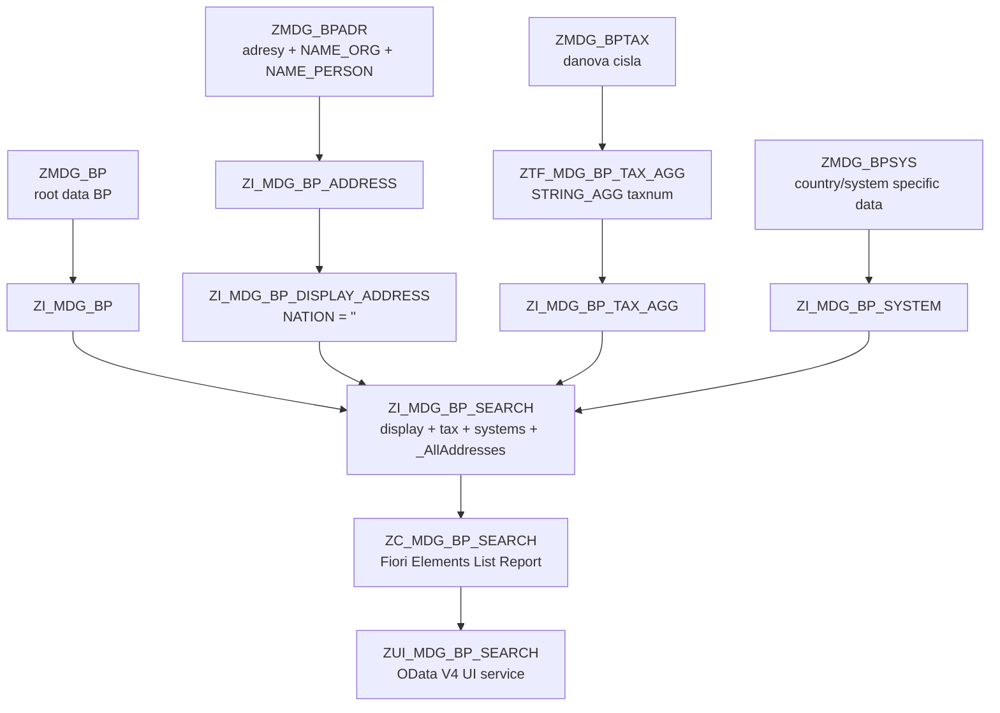

# Navrh RAP/Fiori - vyhledani Business Partneru (All Address Search Pattern)

Tento navrh popisuje jednoduche RAP/Fiori Elements reseni pro vyhledani Business
Partneru nad MDG tabulkami. Reseni nepouziva parametricke `LIKE` v CDS,
nepouziva runtime agregaci pro `$search` a nevyzaduje dalsi search tabulku.
Vyhledavani pres vsechny adresy se resi pres OData V4 lambda filtry nad 1:n
asociaci `_AllAddresses`.

Hlavni princip:

- **Display fields** se ctou pouze z display adresy `ZMDG_BPADR`, kde
  `NATION = ''`. Tim zustane jeden radek pro jeden `PARTNER_GID`.
- **Search/filter fields** jako jmeno, country, city a street se resi pres
  OData V4 lambda filtr nad asociaci `_AllAddresses`, tedy framework generuje
  semantiku typu `EXISTS`.
- Danova cisla zustavaji agregovana do jednoho pole `TaxNumber`.
- Ve vysledkove tabulce neni pole organizace / partner type / partner category.

## 1) Prehled zavislosti



## 2) Datovy princip

Hlavni tabulka je `ZMDG_BP`. Adresy jsou v pomeru `1:n`:

```text
ZMDG_BP 1:n ZMDG_BPADR
```

Kdyby se finalni report napojil primo na vsechny adresy, jeden partner by se
zobrazil vicekrat. Proto se pouziji dve ruzne adresni vrstvy:

1. `ZI_MDG_BP_DISPLAY_ADDRESS`
   - cte pouze `NATION = ''`,
   - slouzi pro zobrazeni hodnot v tabulce,
   - musi vracet maximalne jeden radek pro `PARTNER_GID`.

2. Asociace `_AllAddresses`
   - vystavi vsechny adresy partnera do OData V4,
   - slouzi pro frontend filtry pres lambda operator,
   - napr. country/city/street filtruje pres vsechny adresy, ne jen display adresu.

3. Asociace `_AddressVariants`
   - je filtrovana asociace na `ZI_MDG_BP_ADDRESS` s podminkou `NATION <> ''`,
   - slouzi pro Object Page tabulku `Address variants`,
   - display/default adresa se tim v tabulce variant neopakuje.

4. Fiori lambda filtry
   - name/country/city/street se pridaji pres `_AllAddresses`,
   - filtruje se pres vsechny adresy partnera,
   - list stale zobrazuje display adresu `NATION = ''`.

Tim dostaneme:

```text
vyhledavani pres vsechny adresy
+
zobrazeni jednoho unikatniho radku za PARTNER_GID
```

## 3) Rozsirena adresa ZMDG_BPADR

Do existujici tabulky `ZMDG_BPADR` jsou doplnena dve pripravena search/display
pole:

```abap
name_org    : zmdg_nameorg;   // NAME_ORG1 + NAME_ORG2 + NAME_ORG3 + NAME_ORG4
name_person : zmdg_namepers;  // NAME_FIRST + NAME_LAST
```

Doporucene delky:

```text
ZMDG_NAMEORG   CHAR 180
ZMDG_NAMEPERS  CHAR 100
```

Tato pole jsou dulezita, protoze uzivatel typicky hleda firmu nebo osobu jako
jeden text, ne po technickych castich `NAME_ORG1-4` a `NAME_FIRST/NAME_LAST`.

## 4) Interface/BASIC CDS

### 4.1 BP root

```abap
@EndUserText.label: 'MDG BP Root Interface'
@AccessControl.authorizationCheck: #CHECK
@Metadata.ignorePropagatedAnnotations: true
@VDM.viewType: #BASIC
@ObjectModel.usageType: {
  serviceQuality: #A,
  sizeCategory: #L,
  dataClass: #MASTER
}
define root view entity ZI_MDG_BP
  as select from zmdg_bp as BP
{
  key BP.partner_gid  as PartnerGID,
      BP.parent_gid1  as ParentGID1,
      BP.parent_gid2  as ParentGID2,
      BP.found_date   as FoundDate,
      BP.lei_code     as LeiCode,
      BP.duns         as Duns,
      BP.euid         as Euid
}
```

### 4.2 Address interface

```abap
@EndUserText.label: 'MDG BP Address Interface'
@AccessControl.authorizationCheck: #CHECK
@Metadata.ignorePropagatedAnnotations: true
@VDM.viewType: #BASIC
@UI.headerInfo: {
  typeName: 'Address Variant',
  typeNamePlural: 'Address Variants',
  title: { type: #STANDARD, value: 'AddressVariantTitle' },
  description: { type: #STANDARD, value: 'AddressPreview' }
}
define view entity ZI_MDG_BP_ADDRESS
  as select from zmdg_bpadr as Address
  association [0..1] to TSADVT as _NationText
    on  _NationText.NATION = Address.nation
    and _NationText.LANGU  = $session.system_language
{
  @UI.facet: [
    {
      id: 'AddressVariantDetail',
      purpose: #STANDARD,
      type: #FIELDGROUP_REFERENCE,
      label: 'Address variant detail',
      position: 10,
      targetQualifier: 'AddressVariantDetail'
    }
  ]
  key Address.partner_gid as PartnerGID,
  key Address.nation      as Nation,
  @UI.lineItem: [{ position: 10 }]
      _NationText.NATION_TEX as NationText,
      case
        when Address.nation = ''
          then cast( 'Default' as abap.char(20) )
        when _NationText.NATION_TEX is null
          then cast( Address.nation as abap.char(20) )
        else cast( _NationText.NATION_TEX as abap.char(20) )
      end                 as AddressVariantTitle,
      Address.name_org1   as CompanyName1,
      Address.name_org2   as CompanyName2,
      Address.name_org3   as CompanyName3,
      Address.name_org4   as CompanyName4,
  @UI.fieldGroup: [{ qualifier: 'AddressVariantDetail', position: 10 }]
      Address.name_org    as CompanyName,
      Address.name_first  as FirstName,
      Address.name_last   as LastName,
      Address.name_person as PersonName,
  @UI.fieldGroup: [{ qualifier: 'AddressVariantDetail', position: 20 }]
      Address.bu_sort1    as SearchTerm1,
  @UI.fieldGroup: [{ qualifier: 'AddressVariantDetail', position: 70 }]
      Address.street      as Street,
  @UI.fieldGroup: [{ qualifier: 'AddressVariantDetail', position: 80 }]
      Address.house_num1  as HouseNo,
  @UI.fieldGroup: [{ qualifier: 'AddressVariantDetail', position: 90 }]
      Address.house_num2  as HouseNoSuppl,
  @UI.fieldGroup: [{ qualifier: 'AddressVariantDetail', position: 50 }]
      Address.city1       as City,
  @UI.fieldGroup: [{ qualifier: 'AddressVariantDetail', position: 40 }]
      Address.city2       as District,
  @UI.fieldGroup: [{ qualifier: 'AddressVariantDetail', position: 60 }]
      Address.post_code1  as CityPostal,
  @UI.fieldGroup: [{ qualifier: 'AddressVariantDetail', position: 30 }]
      Address.country     as Country,

  @UI.lineItem: [{ position: 20 }]
      concat_with_space(
        concat_with_space(
          concat_with_space( Address.name_org, Address.street, 1 ),
          concat_with_space( Address.house_num1, Address.post_code1, 1 ),
          1
        ),
        Address.city1,
        1
      )                   as AddressPreview
}
```

Poznamka: Pokud tvoje ABAP CDS verze nepodporuje `concat_with_space`, vystav
`AddressPreview` jako pripravene pole v tabulce/view, nebo ho nahrad jednodussim
vyrazem. `AddressPreview` se pouziva jako popis v headeru detailu adresni
varianty. Tabulka `Address variants` zobrazuje `NationText` a `AddressPreview`;
technicky klic `Nation` se v tabulce nezobrazuje.

Poznamka k nazvu varianty: `NationText` se bere z textove tabulky `TSADVT`
podle `LANGU = $session.system_language` a `NATION`. Header detailu adresni
varianty ale pouziva pole `AddressVariantTitle`, ktere pro prazdne `NATION`
vrati `Default`; jinak vrati text typu `Cyrillic`. Tim nevznikne genericky
nadpis `Unnamed Object`.

### 4.3 Display address

Tato view slouzi pouze pro zobrazena pole. Bere adresu `NATION = ''`.

```abap
@EndUserText.label: 'MDG BP Display Address'
@AccessControl.authorizationCheck: #CHECK
@Metadata.ignorePropagatedAnnotations: true
@VDM.viewType: #BASIC
define view entity ZI_MDG_BP_DISPLAY_ADDRESS
  as select from ZI_MDG_BP_ADDRESS as Address
{
  key Address.PartnerGID,
      Address.Country,
      Address.CompanyName,
      Address.PersonName,
      Address.SearchTerm1,
      Address.FirstName,
      Address.LastName,
      Address.City,
      Address.District,
      Address.Street,
      Address.HouseNo,
      Address.HouseNoSuppl,
      Address.CityPostal
}
where Address.Nation = ''
```

Poznamka: Pokud muze existovat vice adres s `NATION = ''` pro jednoho partnera,
je potreba doplnit pravidlo, ktere garantuje jeden display radek. Napriklad
rankingem v AMDP/table function nebo technickym pravidlem v datech.

### 4.4 Tax number interface

Tato view slouzi pro Object Page sekci `Tax Data`, kde je potreba zobrazit
jednotlive danove zaznamy jako tabulku vcetne popisu typu dane. Agregovane pole
`TaxNumber` zustava zachovane pro List Report.

```abap
@EndUserText.label: 'MDG BP Tax Number Interface'
@AccessControl.authorizationCheck: #CHECK
@Metadata.ignorePropagatedAnnotations: true
@VDM.viewType: #BASIC
define view entity ZI_MDG_BP_TAX
  as select from zmdg_bptax as Tax
  association [0..1] to TFKTAXNUMTYPE_T as _TaxTypeText
    on  _TaxTypeText.TAXTYPE = Tax.taxtype
    and _TaxTypeText.SPRAS   = $session.system_language
{
  key Tax.partner_gid as PartnerGID,
  @UI.lineItem: [{ position: 10 }]
  key Tax.taxtype     as TaxType,

  @UI.lineItem: [{ position: 20 }]
      _TaxTypeText.TEXT as TaxTypeText,

  @UI.lineItem: [{ position: 30 }]
      Tax.taxnum      as TaxNumber
}
where Tax.taxnum is not initial
```

Poznamka: V SE11 over presny nazev jazykoveho a textoveho pole v
`TFKTAXNUMTYPE_T`. V beznych systemech se pouziva `SPRAS`, `TAXTYPE` a `TEXT`.
Pokud ma textove pole jiny nazev, uprav pouze cast `_TaxTypeText.TEXT`.

### 4.5 Country/system specific data interface

Tato view slouzi pro Object Page sekci `Country specific data overview`.
Kazdy radek reprezentuje napojeni partnera do konkretniho systemu/zeme.

Nejdrive vytvor a aktivuj helper view `ZI_MDG_DOMAIN_VALUE_TEXT` ze sekce
`4.6.1`. `ZI_MDG_BP_SYSTEM` ji pouziva pro text domenove hodnoty partner
category.

```abap
@EndUserText.label: 'MDG BP System Interface'
@AccessControl.authorizationCheck: #CHECK
@Metadata.ignorePropagatedAnnotations: true
@VDM.viewType: #BASIC
define view entity ZI_MDG_BP_SYSTEM
  as select from zmdg_bpsys as Sys
  association [0..1] to zmdg_c_sys as _ExtSystemText
    on _ExtSystemText.extsys = Sys.extsys
  association [0..1] to ZI_MDG_DOMAIN_VALUE_TEXT as _PartnerCategoryText
    on  _PartnerCategoryText.DomainName  = 'ZMDG_D_BU_TYPE'
    and _PartnerCategoryText.Language    = $session.system_language
    and _PartnerCategoryText.DomainValue = Sys.type
  association [0..1] to ZI_MDG_DOMAIN_VALUE_TEXT as _PartnerCategoryTextEN
    on  _PartnerCategoryTextEN.DomainName  = 'ZMDG_D_BU_TYPE'
    and _PartnerCategoryTextEN.Language    = 'E'
    and _PartnerCategoryTextEN.DomainValue = Sys.type
  association [0..1] to ZI_MDG_DOMAIN_VALUE_TEXT as _PartnerCategoryTextCS
    on  _PartnerCategoryTextCS.DomainName  = 'ZMDG_D_BU_TYPE'
    and _PartnerCategoryTextCS.Language    = 'C'
    and _PartnerCategoryTextCS.DomainValue = Sys.type
{
  key Sys.partner_gid as PartnerGID,
  key Sys.extsys      as ExtSystem,
  @UI.lineItem: [{ position: 20 }]
  key Sys.partner_id  as PartnerID,

  @UI.lineItem: [{ position: 10 }]
      coalesce(
        _ExtSystemText.description,
        cast( Sys.extsys as abap.char(60) )
      )               as ExtSystemDescription,

  @UI.lineItem: [{ position: 30 }]
      Sys.langu       as Language,

      Sys.type        as PartnerCategoryCode,

  @UI.lineItem: [{ position: 40 }]
      coalesce(
        _PartnerCategoryText.DomainValueText,
        coalesce(
          _PartnerCategoryTextEN.DomainValueText,
          coalesce(
            _PartnerCategoryTextCS.DomainValueText,
            cast( Sys.type as abap.char(60) )
          )
        )
      )               as PartnerCategory,

  @UI.lineItem: [{ position: 50 }]
      Sys.inactive    as Inactive,

      Sys.bu_group        as BusinessPartnerGroup,
      Sys.legal_form      as LegalForm,
      Sys.tel_number      as TelephoneNumber,
      Sys.mob_number      as MobileNumber,
      Sys.smtpadress      as EmailAddress,
      Sys.inactive_reason as InactiveReason
}
```

Poznamka: `ExtSystem` a `PartnerCategoryCode` zustavaji v OData metadatech pro
technickou kontrolu, ale nemaji `@UI.lineItem`, takze se v tabulce nezobrazi.
Sloupec `ExtSystemDescription` bere popis z `ZMDG_C_SYS-DESCRIPTION`; pokud
popis nenajde, zobrazi technicky kod `Sys.extsys`.

Sloupec `PartnerCategory` obsahuje text domenove hodnoty. Nejprve se hleda text
v `$session.system_language`; pokud neexistuje, `coalesce` pouzije anglicky text
z `Language = 'E'`. Pokud neni ani anglicky text, pouzije se cesky text
`Language = 'C'`. Posledni fallback je technicky kod `Sys.type`, aby pole nikdy
nezustalo prazdne.

### 4.6.1 Domain fixed value text helper

Klasicka DDIC view `DD07V` neni ve view entities povolena jako base object a
standardni `I_DomainFixedValue` je SAPem oznacena jako deprecated/internal API
(`Obsolete - Domain Fixed Value`). Proto je nejstabilnejsi vytvorit vlastni
helper view nad tabulkami `DD07L` a `DD07T`.

```abap
@EndUserText.label: 'MDG Domain Fixed Value Text'
@AccessControl.authorizationCheck: #NOT_REQUIRED
@Metadata.ignorePropagatedAnnotations: true
@VDM.viewType: #BASIC
define view entity ZI_MDG_DOMAIN_VALUE_TEXT
  as select from dd07t as Text
{
  key Text.domname      as DomainName,
  key Text.ddlanguage   as Language,
  key Text.domvalue_l   as DomainValue,
      Text.ddtext       as DomainValueText
}
where Text.as4local = 'A'
  and Text.domvalue_l <> ''
```

Pokud by tvoje systemova tabulka `DD07T` nemela pole `AS4LOCAL`, smaz ho z
`where`. V beznych on-premise systemech tam ale byva.

Poznamka k `I_DomainFixedValue`: Napis `Obsolete` neznamena, ze view v systemu
okamzite nefunguje. Znamena, ze SAP ji oznacil jako deprecated/internal API a
nedoporucuje ji jako stabilni zaklad pro vlastni aplikacni model. Proto tady
pouzivame vlastni `ZI_*` helper, ktery je pod nasi kontrolou.

Poznamka: Pokud neni kombinace `PARTNER_GID + EXTSYS + PARTNER_ID` unikatni,
je potreba doplnit do klice jeste dalsi technicke pole. Pro OData Object Page
detailni navigaci musi mit child entita stabilni unikatni klic.

## 5) Agregace danovych cisel

Ve vysledku ma byt jedno pole `TaxNumber`, ktere obsahuje vsechna danova cisla
partnera oddelena carkou.

```abap
@EndUserText.label: 'MDG BP Tax Numbers Aggregated'
@AccessControl.authorizationCheck: #NOT_REQUIRED
define table function ZTF_MDG_BP_TAX_AGG
  returns {
    mandt       : mandt;
    partner_gid : zmdg_partner_gid;
    tax_number  : abap.string;
  }
  implemented by method zcl_mdg_bp_tax_agg=>get_data;
```

AMDP skeleton:

```abap
CLASS zcl_mdg_bp_tax_agg DEFINITION
  PUBLIC FINAL CREATE PUBLIC.
  PUBLIC SECTION.
    INTERFACES if_amdp_marker_hdb.

    CLASS-METHODS get_data
      FOR TABLE FUNCTION ztf_mdg_bp_tax_agg.
ENDCLASS.

CLASS zcl_mdg_bp_tax_agg IMPLEMENTATION.
  METHOD get_data BY DATABASE FUNCTION
                  FOR HDB
                  LANGUAGE SQLSCRIPT
                  OPTIONS READ-ONLY
                  USING zmdg_bptax.

    RETURN
      SELECT mandt,
             partner_gid,
             STRING_AGG( taxnum, ', ' ORDER BY taxtype ) AS tax_number
        FROM zmdg_bptax
       WHERE taxnum IS NOT NULL
         AND taxnum <> ''
       GROUP BY mandt, partner_gid;

  ENDMETHOD.
ENDCLASS.
```

Wrapper interface:

```abap
@EndUserText.label: 'MDG BP Tax Numbers Aggregated Interface'
@AccessControl.authorizationCheck: #CHECK
@Metadata.ignorePropagatedAnnotations: true
@VDM.viewType: #BASIC
define view entity ZI_MDG_BP_TAX_AGG
  as select from ZTF_MDG_BP_TAX_AGG( )
{
  key partner_gid as PartnerGID,
      tax_number  as TaxNumber
}
```

## 6) Asociace pro OData V4 lambda filtry

Pro `Name`, `Country`, `City` a `Street` nevytvarime agregovany string.
Vystavime 1:n asociaci na vsechny adresy a Fiori Elements/OData V4 vygeneruje
lambda filtr nad kolekci, typicky semanticky jako:

```text
_AllAddresses/any(a: a/Country eq 'CZ')
```

Databazove se to prelozi jako poddotaz typu `EXISTS`, coz odpovida pozadavku:
filtrovat pres vsechny adresy, ale v listu zobrazovat jen display adresu
`NATION = ''`.

## 7) Composite search interface

Finalni interface spoji:

- root data `ZI_MDG_BP`,
- display adresu `ZI_MDG_BP_DISPLAY_ADDRESS`,
- agregovana danova cisla `ZI_MDG_BP_TAX_AGG`,
- country/system data `ZI_MDG_BP_SYSTEM`,
- filtrovanou asociaci `_AddressVariants` pro adresni varianty bez
  default/display adresy,
- asociaci `_AllAddresses` pro OData V4 lambda filtry.

```abap
@EndUserText.label: 'MDG BP Search Interface'
@AccessControl.authorizationCheck: #CHECK
@Metadata.ignorePropagatedAnnotations: true
@VDM.viewType: #COMPOSITE
define view entity ZI_MDG_BP_SEARCH
  as select from ZI_MDG_BP as BP
  association [0..1] to ZI_MDG_BP_DISPLAY_ADDRESS as _DisplayAddress
    on _DisplayAddress.PartnerGID = BP.PartnerGID
  association [0..1] to ZI_MDG_BP_TAX_AGG as _Tax
    on _Tax.PartnerGID = BP.PartnerGID
  association [0..*] to ZI_MDG_BP_TAX as _TaxNumbers
    on _TaxNumbers.PartnerGID = BP.PartnerGID
  association [0..*] to ZI_MDG_BP_SYSTEM as _Systems
    on _Systems.PartnerGID = BP.PartnerGID
  association [0..*] to ZI_MDG_BP_ADDRESS as _AddressVariants
    on  _AddressVariants.PartnerGID = BP.PartnerGID
    and _AddressVariants.Nation <> ''
  association [0..*] to ZI_MDG_BP_ADDRESS as _AllAddresses
    on _AllAddresses.PartnerGID = BP.PartnerGID
{
  key BP.PartnerGID,
      BP.ParentGID1,
      BP.ParentGID2,
      BP.FoundDate,
      _DisplayAddress.Country,
      _Tax.TaxNumber,
      _DisplayAddress.CompanyName,
      _DisplayAddress.PersonName,
      _DisplayAddress.SearchTerm1,
      _DisplayAddress.FirstName,
      _DisplayAddress.LastName,
      _DisplayAddress.City,
      _DisplayAddress.District,
      _DisplayAddress.Street,
      _DisplayAddress.HouseNo,
      _DisplayAddress.HouseNoSuppl,
      _DisplayAddress.CityPostal,
      BP.LeiCode,
      BP.Duns,

      _TaxNumbers,
      _Systems,
      _AddressVariants,
      _AllAddresses
}
```

Poznamka: Ve view nejsou explicitni joiny. Display adresa, danova agregace,
all-address search a vsechny adresy jsou pripojene pres asociace. CDS runtime
si technicky join vytvori az pri pouziti poli z asociace, ale model zustava
citelny a semanticky cisty.

## 8) Consumption CDS pro Fiori Elements

Display pole jsou viditelna v tabulce. Asociace `_TaxNumbers`, `_Systems` a
`_AddressVariants` slouzi pro Object Page tabulky. Asociace `_AllAddresses` je
vystavena kvuli Fiori/OData V4 lambda filtrum pres vsechny adresy.

```abap
@EndUserText.label: 'MDG BP Search Consumption'
@AccessControl.authorizationCheck: #CHECK
@Metadata.allowExtensions: true
@UI.headerInfo: {
  typeName: 'Business Partner',
  typeNamePlural: 'Business Partners',
  title: { type: #STANDARD, value: 'PartnerGID' }
}
define view entity ZC_MDG_BP_SEARCH
  as select from ZI_MDG_BP_SEARCH
{
  @UI.facet: [
    {
      id: 'GlobalData',
      purpose: #STANDARD,
      type: #COLLECTION,
      label: 'Global Data (KID)',
      position: 10
    },
    {
      id: 'MainData',
      parentId: 'GlobalData',
      purpose: #STANDARD,
      type: #FIELDGROUP_REFERENCE,
      label: 'Main data',
      position: 10,
      targetQualifier: 'MainData'
    },
    {
      id: 'IdentificationData',
      parentId: 'GlobalData',
      purpose: #STANDARD,
      type: #FIELDGROUP_REFERENCE,
      label: 'Identification data',
      position: 20,
      targetQualifier: 'IdentificationData'
    },
    {
      id: 'TaxData',
      purpose: #STANDARD,
      type: #LINEITEM_REFERENCE,
      label: 'Tax Data',
      position: 20,
      targetElement: '_TaxNumbers'
    },
    {
      id: 'Address',
      purpose: #STANDARD,
      type: #COLLECTION,
      label: 'Address',
      position: 30
    },
    {
      id: 'AddressDisplay',
      parentId: 'Address',
      purpose: #STANDARD,
      type: #FIELDGROUP_REFERENCE,
      label: 'Address',
      position: 10,
      targetQualifier: 'AddressDisplay'
    },
    {
      id: 'AddressVariants',
      parentId: 'Address',
      purpose: #STANDARD,
      type: #LINEITEM_REFERENCE,
      label: 'Address variants',
      position: 20,
      targetElement: '_AddressVariants'
    },
    {
      id: 'CountrySpecificData',
      purpose: #STANDARD,
      type: #LINEITEM_REFERENCE,
      label: 'Country specific data overview',
      position: 40,
      targetElement: '_Systems'
    }
  ]
  @UI.lineItem: [{ position: 10 }]
  @UI.selectionField: [{ position: 10 }]
  @UI.fieldGroup: [{ qualifier: 'MainData', position: 10 }]
  key PartnerGID,

  @UI.fieldGroup: [{ qualifier: 'MainData', position: 20 }]
  ParentGID1,

  @UI.fieldGroup: [{ qualifier: 'MainData', position: 30 }]
  ParentGID2,

  @UI.lineItem: [{ position: 20 }]
  @UI.fieldGroup: [{ qualifier: 'AddressDisplay', position: 10 }]
  Country,

  @UI.lineItem: [{ position: 30 }]
  @UI.selectionField: [{ position: 70 }]
  TaxNumber,

  @UI.lineItem: [{ position: 40 }]
  @UI.fieldGroup: [{ qualifier: 'MainData', position: 40 }]
  CompanyName,

  @UI.lineItem: [{ position: 50 }]
  @UI.fieldGroup: [{ qualifier: 'MainData', position: 45 }]
  PersonName,

  @UI.lineItem: [{ position: 60 }]
  @UI.fieldGroup: [{ qualifier: 'MainData', position: 50 }]
  SearchTerm1,

  @UI.fieldGroup: [{ qualifier: 'MainData', position: 60 }]
  FoundDate,

  @UI.lineItem: [{ position: 70 }]
  @UI.fieldGroup: [{ qualifier: 'AddressDisplay', position: 30 }]
  City,

  @UI.lineItem: [{ position: 80 }]
  @UI.fieldGroup: [{ qualifier: 'AddressDisplay', position: 20 }]
  District,

  @UI.lineItem: [{ position: 90 }]
  @UI.fieldGroup: [{ qualifier: 'AddressDisplay', position: 50 }]
  Street,

  @UI.lineItem: [{ position: 100 }]
  @UI.fieldGroup: [{ qualifier: 'AddressDisplay', position: 60 }]
  HouseNo,

  @UI.lineItem: [{ position: 110 }]
  @UI.fieldGroup: [{ qualifier: 'AddressDisplay', position: 70 }]
  HouseNoSuppl,

  @UI.lineItem: [{ position: 120 }]
  @UI.fieldGroup: [{ qualifier: 'AddressDisplay', position: 40 }]
  CityPostal,

  @UI.lineItem: [{ position: 130 }]
  @UI.fieldGroup: [{ qualifier: 'IdentificationData', position: 10 }]
  LeiCode,

  @UI.lineItem: [{ position: 140 }]
  @UI.fieldGroup: [{ qualifier: 'IdentificationData', position: 20 }]
  Duns,

  _TaxNumbers,
  _Systems,
  _AddressVariants,
  _AllAddresses
}
```

Poznamka k rozlozeni Filter Baru: `PartnerGID` zustava jako prvni explicitni
selection field. Hledani firmy/osoby a adresni filtry se pridaji na frontendu
pres `_AllAddresses/CompanyName`, `_AllAddresses/PersonName`,
`_AllAddresses/Country`, `_AllAddresses/City`, `_AllAddresses/Street`.
`TaxNumber` je zamerne az za nimi.

## 9) Fiori Tools: pridani lambda filtru

Z duvodu architektury CDS nelze spolehlive dat `@UI.selectionField` primo na
pole uvnitr `[0..*]` asociace v ABAP CDS. Filtr se proto prida ve Fiori Tools /
SAP BAS jako local annotation:

1. Otevrit UI projekt ve VS Code nebo SAP BAS.
2. Spustit Page Map: pravy klik na `webapp` -> `Show Page Map`.
3. Otevrit konfiguraci stranky List Report.
4. V sekci Filter Bar kliknout na pridani pole.
5. Rozbalit asociaci `_AllAddresses`.
6. Vybrat adresni pole a nastavit jim poradi ve Filter Baru:
   - `_AllAddresses/CompanyName`, doporucena position `20`
   - `_AllAddresses/PersonName`, doporucena position `30`
   - `_AllAddresses/Country`, doporucena position `40`
   - `_AllAddresses/City`, doporucena position `50`
   - `_AllAddresses/Street`, doporucena position `60`
7. Ulozit local annotations.

Doporucene poradi filtru:

```text
Prvni cast / prvni radek:
- PartnerGID
- Name = `_AllAddresses/CompanyName` a/nebo `_AllAddresses/PersonName`

Druha cast / dalsi pole:
- Country pres _AllAddresses/Country
- City pres _AllAddresses/City
- Street pres _AllAddresses/Street
- TaxNumber
```

Presne zalomeni do radku je responzivni rozhodnuti Fiori Filter Baru, ale toto
poradi dava nejvyssi prioritu partnerovi a hledani jmena, zatimco adresni filtry
a danova cisla jsou az dalsi.

Value help pro tyto filtry muze cist hodnoty primo z `ZMDG_BPADR`, tedy ze
vsech adres:

```abap
@EndUserText.label: 'MDG BP Country Value Help'
@ObjectModel.dataCategory: #VALUE_HELP
@Search.searchable: true
define view entity ZI_MDG_BP_COUNTRY_VH
  as select distinct from zmdg_bpadr as Address
{
  @Search.defaultSearchElement: true
  key Address.country as Country
}
where Address.country is not initial
```

```abap
@EndUserText.label: 'MDG BP City Value Help'
@ObjectModel.dataCategory: #VALUE_HELP
@Search.searchable: true
define view entity ZI_MDG_BP_CITY_VH
  as select distinct from zmdg_bpadr as Address
{
  @Search.defaultSearchElement: true
  key Address.city1 as City
}
where Address.city1 is not initial
```

## 10) Service definition

```abap
@EndUserText.label: 'MDG BP Search Service Definition'
define service ZUI_MDG_BP_SEARCH {
  expose ZC_MDG_BP_SEARCH       as BusinessPartnerSearch;
  expose ZI_MDG_BP_ADDRESS      as BusinessPartnerAddress;
  expose ZI_MDG_BP_TAX          as BusinessPartnerTax;
  expose ZI_MDG_BP_SYSTEM       as BusinessPartnerSystem;
  expose ZI_MDG_BP_COUNTRY_VH   as CountryValueHelp;
  expose ZI_MDG_BP_CITY_VH      as CityValueHelp;
}
```

Pak vytvorit service binding typu **OData V4 - UI**.

## 10.1) Poznamka k Address variant detail v dalsim sloupci

CDS anotace vyse zajisti:

- hlavni Object Page sekci `Address`,
- podsekci display adresy `NATION = ''`,
- tabulku `Address variants` pres navigaci `_AddressVariants`, tedy bez
  default adresy `NATION = ''`,
- tabulku `Country specific data overview` pres navigaci `_Systems`,
- detailni Object Page anotace pro entitu `BusinessPartnerAddress`.

Aby se po kliknuti na radek `Address variants` otevrel `Address variant detail`
v dalsim layout sloupci, je potreba ve Fiori Elements aplikaci zapnout a
dokonfigurovat Flexible Column Layout a navigaci z hlavni object page na
podobject page adresy. To je konfigurace v `manifest.json`, ne v CDS.

Princip konfigurace:

```json
"sap.ui5": {
  "routing": {
    "config": {
      "routerClass": "sap.f.routing.Router"
    }
  }
},
"sap.fiori": {
  "archeType": "transactional"
}
```

Ve Fiori Tools / Page Map pak pridat navigaci:

```text
BusinessPartnerSearch Object Page
  -> _AddressVariants
     -> BusinessPartnerAddress Object Page
```

Pokud Fiori Tools nenabidne navigaci automaticky, je potreba doplnit target pro
`BusinessPartnerAddressObjectPage` rucne do `manifest.json`. CDS cast je ale
pripravena tak, aby detail adresy mel vlastni header a field group
`AddressVariantDetail`.

## 11) Vyhledavani a filtry

- Name filtr se realizuje pres `_AllAddresses/CompanyName` a/nebo
  `_AllAddresses/PersonName`.
- `Country`, `City`, `Street` filtry se realizuji pres `_AllAddresses` jako
  OData V4 lambda filtry.
- Tabulka vysledku zobrazuje hodnoty z display adresy `NATION = ''`.
- Vysledek zustava jeden radek pro jeden `PARTNER_GID`.

## 12) Doporuceni k vykonu

1. Pridat nebo overit indexy:
   - `zmdg_bpadr(partner_gid, nation)`
   - `zmdg_bpadr(partner_gid, country)`
   - `zmdg_bptax(partner_gid, taxtype, taxnum)`
2. Pro name/city/street filtry zvazit indexy nebo fulltext indexy podle realneho
   objemu dat a zpusobu dotazovani.
3. Pro case-insensitive hledani doporucuji ukladat normalizovane hodnoty, napr.
   uppercase bez diakritiky, pokud to domlouvaji business pravidla.
