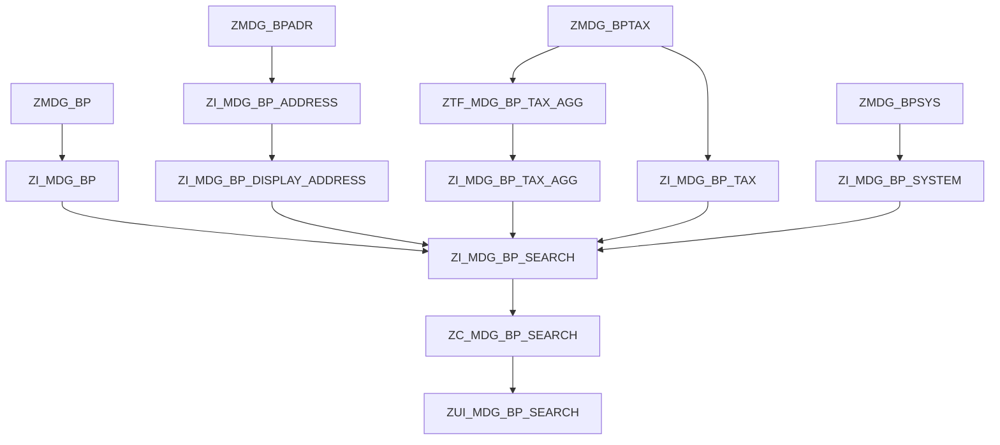

# MDG Search - source overview

Tento soubor popisuje aktuální zdroje aplikace `mdg-search`.
Je to orientační pracovní dokument pro Fiori Elements aplikaci pro vyhledání Business Partnera.

## TypeScript support

Aplikace byla dodatecne prepnuta na TypeScript bez regenerovani projektu.

Runtime zdroje jsou nyni v TypeScriptu:

```text
webapp/Component.ts
webapp/ext/AddressNameSearch.ts
webapp/ext/controller/ListReportExt.ts
```

Odkazy v `manifest.json` a XML fragmentu zustavaji ve tvaru UI5 modulu, napr.:

```text
c4s.mdg.mdgsearch.ext.AddressNameSearch
c4s.mdg.mdgsearch.ext.controller.ListReportExt.onCreateForSystem
```

Build a lokalni server prekladaji TypeScript pres `ui5-tooling-transpile`.
Konfigurace je v:

```text
package.json
tsconfig.json
ui5.yaml
ui5-local.yaml
ui5-mock.yaml
```

Kontrolni prikazy:

```bash
npm run typecheck
npm run build
```

OPA/QUnit testy v `webapp/test` zustavaji v JavaScriptu. TypeScript podpora se tyka aplikacnich runtime modulu.

## Projekt

Adresář:

```text
C:\Users\JTikal\Documents\MDG\mdg-search
```

Namespace aplikace:

```text
c4s.mdg.mdgsearch
```

Aplikace je Fiori Elements List Report / Object Page nad OData V4 službou pro vyhledání Business Partnerů.

## Backend model

Použitý návrh je **All Address Search Pattern**:

- hlavní výsledkový seznam vrací jeden řádek pro jeden `PartnerGID`,
- zobrazená adresa se bere z `ZMDG_BPADR`, kde `NATION = ''`,
- hledání přes všechny adresy jde přes asociaci `_AllAddresses`,
- tabulka Address variants používá jen adresy, kde `NATION <> ''`,
- daňová čísla se pro list report agregují do jednoho textového pole `TaxNumber`,
- Object Page může mít samostatné tabulky pro address variants, tax numbers a country/system specific data.



## Databázové tabulky

### ZMDG_BP

```abap
@EndUserText.label : 'MDG Business Partner'
@AbapCatalog.enhancement.category : #NOT_EXTENSIBLE
@AbapCatalog.tableCategory : #TRANSPARENT
@AbapCatalog.deliveryClass : #A
@AbapCatalog.dataMaintenance : #RESTRICTED
define table zmdg_bp {

  key mandt       : mandt not null;
  key partner_gid : zmdg_partner_gid not null;
  parent_gid1     : zmdg_parent1_gid;
  parent_gid2     : zmdg_parent2_gid;
  found_date      : bu_found_dat;
  duns            : /sapht/rn_duns;
  lei_code        : zmdg_lei_code;
  euid            : zmdg_euid;

}
```

### ZMDG_BPADR

```abap
@EndUserText.label : 'MDG Business Partner Address'
@AbapCatalog.enhancement.category : #NOT_EXTENSIBLE
@AbapCatalog.tableCategory : #TRANSPARENT
@AbapCatalog.deliveryClass : #A
@AbapCatalog.dataMaintenance : #RESTRICTED
define table zmdg_bpadr {

  key mandt       : mandt not null;
  key partner_gid : zmdg_partner_gid not null;
  key nation      : ad_nation not null;
  name_org1       : bu_nameor1;
  name_org2       : bu_nameor2;
  name_org3       : bu_nameor3;
  name_org4       : bu_nameor4;
  name_org        : zmdg_nameorg;
  name_first      : bu_namep_f;
  name_last       : bu_namep_l;
  name_person     : zmdg_namepers;
  bu_sort1        : bu_sort1;
  street          : ad_street;
  house_num1      : ad_hsnm1;
  house_num2      : ad_hsnm2;
  city1           : ad_city1;
  city2           : ad_city2;
  post_code1      : ad_pstcd1;
  country         : land1;

}
```

Poznámka: `name_org` a `name_person` jsou připravená display/search pole. Díky nim frontend nemusí skládat firmu z `NAME_ORG1-4` ani osobu z `NAME_FIRST/NAME_LAST`.

### ZMDG_BPTAX

```abap
@EndUserText.label : 'MDG Business Partner Tax Numbers'
@AbapCatalog.enhancement.category : #NOT_EXTENSIBLE
@AbapCatalog.tableCategory : #TRANSPARENT
@AbapCatalog.deliveryClass : #A
@AbapCatalog.dataMaintenance : #RESTRICTED
define table zmdg_bptax {

  key mandt       : mandt not null;
  key partner_gid : zmdg_partner_gid not null;
  key taxtype     : bptaxtype not null;
  taxnum          : bptaxnum;

}
```

### ZMDG_BPSYS

```abap
@EndUserText.label : 'MDG Business Partner System Data'
@AbapCatalog.enhancement.category : #NOT_EXTENSIBLE
@AbapCatalog.tableCategory : #TRANSPARENT
@AbapCatalog.deliveryClass : #A
@AbapCatalog.dataMaintenance : #RESTRICTED
define table zmdg_bpsys {

  key mandt       : mandt not null;
  key partner_gid : zmdg_partner_gid not null;
  key extsys      : zmdg_extsys not null;
  partner_id      : bu_partner;
  type            : zmdg_bu_type;
  bu_group        : zmdg_bu_group;
  langu           : langu;
  legal_form      : zmdg_bu_legenty;
  tel_number      : ad_tlnmbr1;
  mob_number      : ad_mbnmbr1;
  smtpadress      : ad_smtpadr;
  inactive        : zmdg_inactive;
  inactive_reason : zmdg_inact_reason;

}
```

### ZMDG_C_SYS

```abap
@EndUserText.label : 'Nastavení připojených systémů'
@AbapCatalog.enhancement.category : #NOT_EXTENSIBLE
@AbapCatalog.tableCategory : #TRANSPARENT
@AbapCatalog.deliveryClass : #C
@AbapCatalog.dataMaintenance : #ALLOWED
define table zmdg_c_sys {

  key mandt   : mandt not null;
  key extsys  : zmdg_extsys not null;
  type        : zmdg_sys_type;
  description : zmdg_description;
  comm_class  : zmdg_comm_class;
  def_alpha   : zmdg_alpha;
  xcrea       : zmdg_xcrea;
  xenh        : zmdg_xenh;

}
```

## Interface CDS

### ZI_MDG_BP

```abap
@EndUserText.label: 'MDG BP Root Interface'
@AccessControl.authorizationCheck: #NOT_REQUIRED
@Metadata.ignorePropagatedAnnotations: true
@VDM.viewType: #BASIC
@ObjectModel.usageType: {
  serviceQuality: #A,
  sizeCategory: #L,
  dataClass: #MASTER
}
define root view entity ZI_MDG_BP
  as select from zmdg_bp as BP
{
  key BP.partner_gid  as PartnerGID,
      BP.parent_gid1  as ParentGID1,
      BP.parent_gid2  as ParentGID2,
      BP.found_date   as FoundDate,
      BP.lei_code     as LeiCode,
      BP.duns         as Duns,
      BP.euid         as Euid
}
```

### ZI_MDG_BP_ADDRESS

```abap
@EndUserText.label: 'MDG BP Address Interface'
@AccessControl.authorizationCheck: #NOT_REQUIRED
@Metadata.ignorePropagatedAnnotations: true
@VDM.viewType: #BASIC
@UI.headerInfo: {
  typeName: 'Address Variant',
  typeNamePlural: 'Address Variants',
  title: { type: #STANDARD, value: 'AddressVariantTitle' },
  description: { type: #STANDARD, value: 'AddressPreview' }
}
define view entity ZI_MDG_BP_ADDRESS
  as select from zmdg_bpadr as Address
  association [0..1] to TSADVT as _NationText
    on  _NationText.NATION = Address.nation
    and _NationText.LANGU  = $session.system_language
{
  @UI.facet: [
    {
      id: 'AddressVariantDetail',
      purpose: #STANDARD,
      type: #FIELDGROUP_REFERENCE,
      label: 'Address variant detail',
      position: 10,
      targetQualifier: 'AddressVariantDetail'
    }
  ]
  key Address.partner_gid as PartnerGID,
  key Address.nation      as Nation,

  @UI.lineItem: [{ position: 10, label: 'Nation' }]
      _NationText.NATION_TEX as NationText,

      case
        when Address.nation = ''
          then cast( 'Default' as abap.char(20) )
        when _NationText.NATION_TEX is null
          then cast( Address.nation as abap.char(20) )
        else cast( _NationText.NATION_TEX as abap.char(20) )
      end                 as AddressVariantTitle,

      Address.name_org1   as CompanyName1,
      Address.name_org2   as CompanyName2,
      Address.name_org3   as CompanyName3,
      Address.name_org4   as CompanyName4,

  @UI.lineItem: [{ position: 20, label: 'Company Name' }]
  @UI.fieldGroup: [{ qualifier: 'AddressVariantDetail', position: 10, label: 'Company Name' }]
      Address.name_org    as CompanyName,

      Address.name_first  as FirstName,
      Address.name_last   as LastName,
      Address.name_person as PersonName,

  @UI.fieldGroup: [{ qualifier: 'AddressVariantDetail', position: 20, label: 'Search Term' }]
      Address.bu_sort1    as SearchTerm1,

  @UI.lineItem: [{ position: 60, label: 'Street' }]
  @UI.fieldGroup: [{ qualifier: 'AddressVariantDetail', position: 70, label: 'Street' }]
      Address.street      as Street,

  @UI.fieldGroup: [{ qualifier: 'AddressVariantDetail', position: 80, label: 'House No' }]
      Address.house_num1  as HouseNo,

  @UI.fieldGroup: [{ qualifier: 'AddressVariantDetail', position: 90, label: 'House No Suppl.' }]
      Address.house_num2  as HouseNoSuppl,

  @UI.lineItem: [{ position: 40, label: 'City' }]
  @UI.fieldGroup: [{ qualifier: 'AddressVariantDetail', position: 50, label: 'City' }]
      Address.city1       as City,

  @UI.fieldGroup: [{ qualifier: 'AddressVariantDetail', position: 40, label: 'District' }]
      Address.city2       as District,

  @UI.lineItem: [{ position: 50, label: 'Postal Code' }]
  @UI.fieldGroup: [{ qualifier: 'AddressVariantDetail', position: 60, label: 'Postal Code' }]
      Address.post_code1  as CityPostal,

  @UI.lineItem: [{ position: 30, label: 'Country' }]
  @UI.fieldGroup: [{ qualifier: 'AddressVariantDetail', position: 30, label: 'Country' }]
      Address.country     as Country,

      concat_with_space(
        concat_with_space(
          concat_with_space( Address.name_org, Address.street, 1 ),
          concat_with_space( Address.house_num1, Address.post_code1, 1 ),
          1
        ),
        Address.city1,
        1
      )                   as AddressPreview
}
```

### ZI_MDG_BP_DISPLAY_ADDRESS

```abap
@EndUserText.label: 'MDG BP Display Address'
@AccessControl.authorizationCheck: #NOT_REQUIRED
@Metadata.ignorePropagatedAnnotations: true
@VDM.viewType: #BASIC
define view entity ZI_MDG_BP_DISPLAY_ADDRESS
  as select from ZI_MDG_BP_ADDRESS as Address
{
  key Address.PartnerGID,
      Address.Country,
      Address.CompanyName,
      Address.PersonName,
      Address.SearchTerm1,
      Address.FirstName,
      Address.LastName,
      Address.City,
      Address.District,
      Address.Street,
      Address.HouseNo,
      Address.HouseNoSuppl,
      Address.CityPostal
}
where Address.Nation = ''
```

### ZI_MDG_BP_TAX

```abap
@EndUserText.label: 'MDG BP Tax Number Interface'
@AccessControl.authorizationCheck: #NOT_REQUIRED
@Metadata.ignorePropagatedAnnotations: true
@VDM.viewType: #BASIC
define view entity ZI_MDG_BP_TAX
  as select from zmdg_bptax as Tax
  association [0..1] to TFKTAXNUMTYPE_T as _TaxTypeText
    on  _TaxTypeText.TAXTYPE = Tax.taxtype
    and _TaxTypeText.SPRAS   = $session.system_language
{
  key Tax.partner_gid as PartnerGID,

  @UI.lineItem: [{ position: 10, label: 'Tax Type' }]
  key Tax.taxtype     as TaxType,

  @UI.lineItem: [{ position: 20, label: 'Tax Type Text' }]
      _TaxTypeText.TEXT as TaxTypeText,

  @UI.lineItem: [{ position: 30, label: 'Tax Number' }]
      Tax.taxnum      as TaxNumber
}
where Tax.taxnum is not initial
```

### ZTF_MDG_BP_TAX_AGG

```abap
@EndUserText.label: 'MDG BP Tax Numbers Aggregated'
@AccessControl.authorizationCheck: #NOT_REQUIRED
define table function ZTF_MDG_BP_TAX_AGG
  returns {
    mandt       : mandt;
    partner_gid : zmdg_partner_gid;
    tax_number  : abap.string;
  }
  implemented by method zcl_mdg_bp_tax_agg=>get_data;
```

AMDP skeleton:

```abap
CLASS zcl_mdg_bp_tax_agg DEFINITION
  PUBLIC FINAL CREATE PUBLIC.
  PUBLIC SECTION.
    INTERFACES if_amdp_marker_hdb.

    CLASS-METHODS get_data
      FOR TABLE FUNCTION ztf_mdg_bp_tax_agg.
ENDCLASS.

CLASS zcl_mdg_bp_tax_agg IMPLEMENTATION.
  METHOD get_data BY DATABASE FUNCTION
                  FOR HDB
                  LANGUAGE SQLSCRIPT
                  OPTIONS READ-ONLY
                  USING zmdg_bptax.

    RETURN
      SELECT mandt,
             partner_gid,
             STRING_AGG( taxnum, ', ' ORDER BY taxtype ) AS tax_number
        FROM zmdg_bptax
       WHERE taxnum IS NOT NULL
         AND taxnum <> ''
       GROUP BY mandt, partner_gid;

  ENDMETHOD.
ENDCLASS.
```

### ZI_MDG_BP_TAX_AGG

```abap
@EndUserText.label: 'MDG BP Tax Numbers Aggregated Interface'
@AccessControl.authorizationCheck: #NOT_REQUIRED
@Metadata.ignorePropagatedAnnotations: true
@VDM.viewType: #BASIC
define view entity ZI_MDG_BP_TAX_AGG
  as select from ZTF_MDG_BP_TAX_AGG( )
{
  key partner_gid as PartnerGID,
      tax_number  as TaxNumber
}
```

### ZI_MDG_DOMAIN_VALUE_TEXT

```abap
@EndUserText.label: 'MDG Domain Fixed Value Text'
@AccessControl.authorizationCheck: #NOT_REQUIRED
@Metadata.ignorePropagatedAnnotations: true
@VDM.viewType: #BASIC
define view entity ZI_MDG_DOMAIN_VALUE_TEXT
  as select from dd07t as Text
{
  key Text.domname      as DomainName,
  key Text.ddlanguage   as Language,
  key Text.domvalue_l   as DomainValue,
      Text.ddtext       as DomainValueText
}
where Text.as4local = 'A'
  and Text.domvalue_l <> ''
```

### ZI_MDG_BP_SYSTEM

```abap
@EndUserText.label: 'MDG BP System Interface'
@AccessControl.authorizationCheck: #NOT_REQUIRED
@Metadata.ignorePropagatedAnnotations: true
@VDM.viewType: #BASIC
define view entity ZI_MDG_BP_SYSTEM
  as select from zmdg_bpsys as Sys
  association [0..1] to zmdg_c_sys as _ExtSystemText
    on _ExtSystemText.extsys = Sys.extsys
  association [0..1] to ZI_MDG_DOMAIN_VALUE_TEXT as _PartnerCategoryText
    on  _PartnerCategoryText.DomainName  = 'ZMDG_D_BU_TYPE'
    and _PartnerCategoryText.Language    = $session.system_language
    and _PartnerCategoryText.DomainValue = Sys.type
  association [0..1] to ZI_MDG_DOMAIN_VALUE_TEXT as _PartnerCategoryTextEN
    on  _PartnerCategoryTextEN.DomainName  = 'ZMDG_D_BU_TYPE'
    and _PartnerCategoryTextEN.Language    = 'E'
    and _PartnerCategoryTextEN.DomainValue = Sys.type
  association [0..1] to ZI_MDG_DOMAIN_VALUE_TEXT as _PartnerCategoryTextCS
    on  _PartnerCategoryTextCS.DomainName  = 'ZMDG_D_BU_TYPE'
    and _PartnerCategoryTextCS.Language    = 'C'
    and _PartnerCategoryTextCS.DomainValue = Sys.type
{
  key Sys.partner_gid as PartnerGID,
  key Sys.extsys      as ExtSystem,

  @UI.lineItem: [{ position: 20, label: 'Partner ID' }]
  key Sys.partner_id  as PartnerID,

  @UI.lineItem: [{ position: 10, label: 'External System' }]
      coalesce(
        _ExtSystemText.description,
        cast( Sys.extsys as abap.char(60) )
      )               as ExtSystemDescription,

  @UI.lineItem: [{ position: 30, label: 'Language' }]
      Sys.langu       as Language,

      Sys.type        as PartnerCategoryCode,

  @UI.lineItem: [{ position: 40, label: 'Partner Category' }]
      coalesce(
        _PartnerCategoryText.DomainValueText,
        coalesce(
          _PartnerCategoryTextEN.DomainValueText,
          coalesce(
            _PartnerCategoryTextCS.DomainValueText,
            cast( Sys.type as abap.char(60) )
          )
        )
      )               as PartnerCategory,

  @UI.lineItem: [{ position: 50, label: 'Inactive' }]
      Sys.inactive    as Inactive,

      Sys.bu_group        as BusinessPartnerGroup,
      Sys.legal_form      as LegalForm,
      Sys.tel_number      as TelephoneNumber,
      Sys.mob_number      as MobileNumber,
      Sys.smtpadress      as EmailAddress,
      Sys.inactive_reason as InactiveReason
}
```

### ZI_MDG_BP_SEARCH

```abap
@EndUserText.label: 'MDG BP Search Interface'
@AccessControl.authorizationCheck: #NOT_REQUIRED
@Metadata.ignorePropagatedAnnotations: true
@VDM.viewType: #COMPOSITE
define view entity ZI_MDG_BP_SEARCH
  as select from ZI_MDG_BP as BP
  association [0..1] to ZI_MDG_BP_DISPLAY_ADDRESS as _DisplayAddress
    on _DisplayAddress.PartnerGID = BP.PartnerGID
  association [0..1] to ZI_MDG_BP_TAX_AGG as _Tax
    on _Tax.PartnerGID = BP.PartnerGID
  association [0..*] to ZI_MDG_BP_TAX as _TaxNumbers
    on _TaxNumbers.PartnerGID = BP.PartnerGID
  association [0..*] to ZI_MDG_BP_SYSTEM as _Systems
    on _Systems.PartnerGID = BP.PartnerGID
  association [0..*] to ZI_MDG_BP_ADDRESS as _AddressVariants
    on  _AddressVariants.PartnerGID = BP.PartnerGID
    and _AddressVariants.Nation <> ''
  association [0..*] to ZI_MDG_BP_ADDRESS as _AllAddresses
    on _AllAddresses.PartnerGID = BP.PartnerGID
{
  key BP.PartnerGID,
      BP.ParentGID1,
      BP.ParentGID2,
      BP.FoundDate,
      _DisplayAddress.Country,
      _Tax.TaxNumber,
      _DisplayAddress.CompanyName,
      _DisplayAddress.PersonName,
      _DisplayAddress.SearchTerm1,
      _DisplayAddress.FirstName,
      _DisplayAddress.LastName,
      _DisplayAddress.City,
      _DisplayAddress.District,
      _DisplayAddress.Street,
      _DisplayAddress.HouseNo,
      _DisplayAddress.HouseNoSuppl,
      _DisplayAddress.CityPostal,
      BP.LeiCode,
      BP.Duns,
      BP.Euid,

      _TaxNumbers,
      _Systems,
      _AddressVariants,
      _AllAddresses
}
```

## Consumption CDS

### ZC_MDG_BP_SEARCH

```abap
@EndUserText.label: 'MDG BP Search Consumption'
@AccessControl.authorizationCheck: #NOT_REQUIRED
@Metadata.allowExtensions: true
@UI.headerInfo: {
  typeName: 'Business Partner',
  typeNamePlural: 'Business Partners',
  title: { type: #STANDARD, value: 'PartnerGID' },
  description: { type: #STANDARD, value: 'CompanyName' }
}
define root view entity ZC_MDG_BP_SEARCH
  as projection on ZI_MDG_BP_SEARCH
{
  @UI.facet: [
    {
      id: 'GlobalData',
      purpose: #STANDARD,
      type: #COLLECTION,
      label: 'Global Data (KID)',
      position: 10
    },
    {
      id: 'MainData',
      parentId: 'GlobalData',
      purpose: #STANDARD,
      type: #FIELDGROUP_REFERENCE,
      label: 'Main data',
      position: 10,
      targetQualifier: 'MainData'
    },
    {
      id: 'IdentificationData',
      parentId: 'GlobalData',
      purpose: #STANDARD,
      type: #FIELDGROUP_REFERENCE,
      label: 'Identification data',
      position: 20,
      targetQualifier: 'IdentificationData'
    },
    {
      id: 'TaxData',
      purpose: #STANDARD,
      type: #LINEITEM_REFERENCE,
      label: 'Tax Data',
      position: 20,
      targetElement: '_TaxNumbers'
    },
    {
      id: 'Address',
      purpose: #STANDARD,
      type: #COLLECTION,
      label: 'Address',
      position: 30
    },
    {
      id: 'AddressDisplay',
      parentId: 'Address',
      purpose: #STANDARD,
      type: #FIELDGROUP_REFERENCE,
      label: 'Address',
      position: 10,
      targetQualifier: 'AddressDisplay'
    },
    {
      id: 'AddressVariants',
      parentId: 'Address',
      purpose: #STANDARD,
      type: #LINEITEM_REFERENCE,
      label: 'Address variants',
      position: 20,
      targetElement: '_AddressVariants'
    },
    {
      id: 'CountrySpecificData',
      purpose: #STANDARD,
      type: #LINEITEM_REFERENCE,
      label: 'Country specific data overview',
      position: 40,
      targetElement: '_Systems'
    }
  ]
  @UI.lineItem: [{ position: 10, label: 'Partner GID' }]
  @UI.selectionField: [{ position: 10 }]
  @UI.fieldGroup: [{ qualifier: 'MainData', position: 10, label: 'Partner GID' }]
  key PartnerGID,

  @UI.fieldGroup: [{ qualifier: 'MainData', position: 20, label: 'Parent GID 1' }]
  ParentGID1,

  @UI.fieldGroup: [{ qualifier: 'MainData', position: 30, label: 'Parent GID 2' }]
  ParentGID2,

  @UI.lineItem: [{ position: 20, label: 'Country' }]
  @UI.fieldGroup: [{ qualifier: 'AddressDisplay', position: 10, label: 'Country' }]
  Country,

  @UI.lineItem: [{ position: 30, label: 'Tax Number' }]
  @UI.selectionField: [{ position: 70 }]
  TaxNumber,

  @UI.lineItem: [{ position: 40, label: 'Company Name' }]
  @UI.fieldGroup: [{ qualifier: 'MainData', position: 40, label: 'Company Name' }]
  CompanyName,

  @UI.lineItem: [{ position: 50, label: 'Person Name' }]
  @UI.fieldGroup: [{ qualifier: 'MainData', position: 45, label: 'Person Name' }]
  PersonName,

  @UI.lineItem: [{ position: 60, label: 'Search Term' }]
  @UI.fieldGroup: [{ qualifier: 'MainData', position: 50, label: 'Search Term' }]
  SearchTerm1,

  @UI.fieldGroup: [{ qualifier: 'MainData', position: 60, label: 'Found Date' }]
  FoundDate,

  @UI.lineItem: [{ position: 70, label: 'City' }]
  @UI.fieldGroup: [{ qualifier: 'AddressDisplay', position: 30, label: 'City' }]
  City,

  @UI.lineItem: [{ position: 80, label: 'District' }]
  @UI.fieldGroup: [{ qualifier: 'AddressDisplay', position: 20, label: 'District' }]
  District,

  @UI.lineItem: [{ position: 90, label: 'Street' }]
  @UI.fieldGroup: [{ qualifier: 'AddressDisplay', position: 50, label: 'Street' }]
  Street,

  @UI.lineItem: [{ position: 100, label: 'House No' }]
  @UI.fieldGroup: [{ qualifier: 'AddressDisplay', position: 60, label: 'House No' }]
  HouseNo,

  @UI.lineItem: [{ position: 110, label: 'House No Suppl.' }]
  @UI.fieldGroup: [{ qualifier: 'AddressDisplay', position: 70, label: 'House No Suppl.' }]
  HouseNoSuppl,

  @UI.lineItem: [{ position: 120, label: 'Postal Code' }]
  @UI.fieldGroup: [{ qualifier: 'AddressDisplay', position: 40, label: 'Postal Code' }]
  CityPostal,

  @UI.lineItem: [{ position: 130, label: 'LEI Code' }]
  @UI.fieldGroup: [{ qualifier: 'IdentificationData', position: 10, label: 'LEI Code' }]
  LeiCode,

  @UI.lineItem: [{ position: 140, label: 'DUNS Number' }]
  @UI.fieldGroup: [{ qualifier: 'IdentificationData', position: 20, label: 'DUNS Number' }]
  Duns,

  @UI.fieldGroup: [{ qualifier: 'IdentificationData', position: 30, label: 'EUID' }]
  Euid,

  _TaxNumbers,
  _Systems,
  _AddressVariants,
  _AllAddresses
}
```

## Service definition

```abap
@EndUserText.label: 'MDG BP Search Service Definition'
define service ZUI_MDG_BP_SEARCH {
  expose ZC_MDG_BP_SEARCH       as BusinessPartnerSearch;
  expose ZI_MDG_BP_ADDRESS      as BusinessPartnerAddress;
  expose ZI_MDG_BP_TAX          as BusinessPartnerTax;
  expose ZI_MDG_BP_SYSTEM       as BusinessPartnerSystem;
}
```

## package.json

```json
{
  "name": "mdg-search",
  "version": "0.0.1",
  "description": "Search business partners in MDG",
  "main": "webapp/index.html",
  "scripts": {
    "start": "fiori run --open \"test/flp.html#app-preview\"",
    "start-local": "fiori run --config ./ui5-local.yaml --open \"test/flp.html#app-preview\"",
    "build": "ui5 build --config=ui5.yaml --clean-dest --dest dist",
    "lint": "eslint ./",
    "start-mock": "fiori run --config ./ui5-mock.yaml --open \"test/flp.html#app-preview\"",
    "deploy": "fiori verify",
    "deploy-config": "fiori add deploy-config",
    "start-noflp": "fiori run --open \"/index.html?sap-ui-xx-viewCache=false\"",
    "int-test": "fiori run --config ./ui5-mock.yaml --open \"/test/integration/opaTests.qunit.html\"",
    "start-variants-management": "fiori run --open \"/preview.html#app-preview\""
  }
}
```

Poznámka: projekt nemá script `start-backend`. Pro lokální spuštění používej hlavně `npm run start` nebo `npm run start-local`.

## Služba

Hlavní služba v `webapp/manifest.json`:

```json
"mainService": {
  "uri": "/sap/opu/odata4/sap/zui_mdg_bp_search_o4ui/srvd/sap/zui_mdg_bp_search/0001/",
  "type": "OData",
  "settings": {
    "annotations": [
      "annotation"
    ],
    "localUri": "localService/mainService/metadata.xml",
    "odataVersion": "4.0"
  }
},
"createService": {
  "uri": "/sap/opu/odata4/sap/zui_mdg_req_o4/srvd/sap/zui_mdg_req/0001/",
  "type": "OData",
  "settings": {
    "odataVersion": "4.0"
  }
}
```

Lokální anotace:

```json
"annotation": {
  "type": "ODataAnnotation",
  "uri": "annotations/annotation.xml",
  "settings": {
    "localUri": "annotations/annotation.xml"
  }
}
```

## Entity z metadat

Z lokálních metadat `webapp/localService/mainService/metadata.xml`:

```text
BusinessPartnerSearch
  EntityType: BusinessPartnerSearchType
  Navigation:
    _AllAddresses -> BusinessPartnerAddress

BusinessPartnerAddress
  EntityType: BusinessPartnerAddressType

CountryValueHelp
  EntityType: CountryValueHelpType
```

Hlavní list report běží nad:

```text
/BusinessPartnerSearch
```

## Routing

Z `webapp/manifest.json`:

```json
{
  "pattern": ":?query:",
  "name": "BusinessPartnerSearchList",
  "target": [
    "BusinessPartnerSearchList"
  ]
}
```

```json
{
  "pattern": "BusinessPartnerSearch({key}):?query:",
  "name": "BusinessPartnerSearchObjectPage",
  "target": [
    "BusinessPartnerSearchList",
    "BusinessPartnerSearchObjectPage"
  ]
}
```

```json
{
  "pattern": "BusinessPartnerSearch({key})/_AddressVariants({key2}):?query:",
  "name": "BusinessPartnerAddressObjectPage",
  "target": [
    "BusinessPartnerSearchList",
    "BusinessPartnerSearchObjectPage",
    "BusinessPartnerAddressObjectPage"
  ]
}
```

## List Report Target

Hlavní target:

```json
"BusinessPartnerSearchList": {
  "type": "Component",
  "id": "BusinessPartnerSearchList",
  "name": "sap.fe.templates.ListReport",
  "contextPattern": "",
  "options": {
    "settings": {
      "contextPath": "/BusinessPartnerSearch",
      "variantManagement": "Page"
    }
  },
  "controlAggregation": "beginColumnPages"
}
```

## Lokální UI anotace

Soubor:

```text
webapp/annotations/annotation.xml
```

Selection fields:

```xml
<Annotation Term="UI.SelectionFields">
    <Collection>
        <PropertyPath>PartnerGID</PropertyPath>
        <PropertyPath>TaxNumber</PropertyPath>
        <PropertyPath>_AllAddresses/Country</PropertyPath>
        <PropertyPath>_AllAddresses/City</PropertyPath>
        <PropertyPath>_AllAddresses/Street</PropertyPath>
    </Collection>
</Annotation>
```

Line item:

```xml
<Annotation Term="UI.LineItem">
    <Collection>
        <Record Type="UI.DataField">
            <PropertyValue Property="Value" Path="PartnerGID"/>
        </Record>
        <Record Type="UI.DataField">
            <PropertyValue Property="Value" Path="Country"/>
        </Record>
        <Record Type="UI.DataField">
            <PropertyValue Property="Value" Path="TaxNumber"/>
        </Record>
        <Record Type="UI.DataField">
            <PropertyValue Property="Value" Path="CompanyName"/>
        </Record>
        <Record Type="UI.DataField">
            <PropertyValue Property="Value" Path="PersonName"/>
        </Record>
        <Record Type="UI.DataField">
            <PropertyValue Property="Value" Path="City"/>
        </Record>
        <Record Type="UI.DataField">
            <PropertyValue Property="Value" Path="Street"/>
        </Record>
        <Record Type="UI.DataField">
            <PropertyValue Property="Value" Path="HouseNo"/>
        </Record>
        <Record Type="UI.DataField">
            <PropertyValue Property="Value" Path="HouseNoSuppl"/>
        </Record>
        <Record Type="UI.DataField">
            <PropertyValue Property="Value" Path="CityPostal"/>
        </Record>
        <Record Type="UI.DataField">
            <PropertyValue Property="Value" Path="LeiCode"/>
        </Record>
        <Record Type="UI.DataField">
            <PropertyValue Property="Value" Path="Duns"/>
        </Record>
    </Collection>
</Annotation>
```

## Custom filter: Address Name

V `manifest.json` je přidán vlastní filtr do `SelectionFields`:

```json
"AddressNameSearch": {
  "label": "{i18n>addressNameSearch}",
  "property": "_AllAddresses/CompanyName",
  "availability": "Default",
  "template": "c4s.mdg.mdgsearch.ext.AddressNameSearch",
  "position": {
    "placement": "After",
    "anchor": "PartnerGID"
  }
}
```

Fragment:

```xml
<core:FragmentDefinition xmlns:core="sap.ui.core" xmlns="sap.m">
    <Input
        width="100%"
        placeholder="{i18n>addressNameSearchPlaceholder}"
        core:require="{
            Value: 'sap/fe/macros/filter/type/Value'
        }"
        value="{path: 'filterValues>', type: 'Value', formatOptions: { operator: 'c4s.mdg.mdgsearch.ext.AddressNameSearch.onAddressNameContains' }}"
    />
</core:FragmentDefinition>
```

Handler:

```js
sap.ui.define(["sap/ui/model/Filter", "sap/ui/model/FilterOperator"], function (Filter, FilterOperator) {
    "use strict";

    return {
        onAddressNameContains: function (vValue) {
            var sValue = Array.isArray(vValue) ? vValue[0] : vValue;

            if (!sValue || !String(sValue).trim()) {
                return null;
            }

            sValue = String(sValue).trim();

            return new Filter({
                filters: [
                    new Filter({
                        path: "CompanyName",
                        operator: FilterOperator.Contains,
                        value1: sValue
                    }),
                    new Filter({
                        path: "PersonName",
                        operator: FilterOperator.Contains,
                        value1: sValue
                    }),
                    new Filter({
                        path: "_AllAddresses",
                        operator: FilterOperator.Any,
                        variable: "addr",
                        condition: new Filter({
                            filters: [
                                new Filter({
                                    path: "addr/CompanyName",
                                    operator: FilterOperator.Contains,
                                    value1: sValue
                                }),
                                new Filter({
                                    path: "addr/PersonName",
                                    operator: FilterOperator.Contains,
                                    value1: sValue
                                })
                            ],
                            and: false
                        })
                    })
                ],
                and: false
            });
        }
    };
});
```

## Custom action: Create for System

Tlačítko je přidané do toolbaru tabulky List Reportu přes `controlConfiguration`:

```json
"@com.sap.vocabularies.UI.v1.LineItem": {
  "actions": {
    "CreateForSystem": {
      "press": "c4s.mdg.mdgsearch.ext.controller.ListReportExt.onCreateForSystem",
      "visible": true,
      "enabled": true,
      "requiresSelection": false,
      "text": "{i18n>createForSystem}"
    }
  },
  "tableSettings": {
    "type": "ResponsiveTable",
    "personalization": {
      "column": true,
      "sort": true,
      "filter": true
    }
  }
}
```

Aktuální handler:

```js
sap.ui.define(
    [
        "sap/m/MessageBox",
        "sap/m/SelectDialog",
        "sap/m/StandardListItem",
        "sap/ui/model/Filter",
        "sap/ui/model/FilterOperator"
    ],
    function (MessageBox, SelectDialog, StandardListItem, Filter, FilterOperator) {
    "use strict";

    var oCreateForSystemDialog;

    return {
        onCreateForSystem: function () {
            getCreateForSystemDialog().open();
        }
    };
});
```

Soubor handleru musí být přesně:

```text
webapp/ext/controller/ListReportExt.js
```

Ne `ListReportExt.controller.js`, protože manifest odkazuje modul:

```text
c4s.mdg.mdgsearch.ext.controller.ListReportExt
```

Handler aktuálně:

1. otevře `sap.m.SelectDialog`,
2. nechá uživatele vybrat externí systém,
3. na `localhost` použije přímou vývojovou URL aplikace `mdg-create`,
4. mimo lokální běh zavolá FLP navigaci:

```js
oCrossAppNavigation.toExternal({
    target: {
        semanticObject: "MDGBpRequest",
        action: "create"
    },
    params: {
        ExternalSystem: [sExternalSystem]
    }
});
```

Poznámka: Seznam systémů je v handleru zatím klientský prototyp. Až bude ve službě dostupný entity set pro `ZMDG_C_SYS` / create value help, nahradí se lokální `JSONModel` čtením z OData.

Dialog je vytvořen singleton patternem v proměnné `oCreateForSystemDialog`, takže se při každém kliknutí nezakládá nová instance. Při prvním vytvoření je připojen přes `oView.addDependent(oCreateForSystemDialog)`, aby sdílel lifecycle stránky a UI5 ho korektně uklidil spolu s view.

Lokální fallback používá:

```text
http://localhost:8080/test/flp.html?sap-ui-xx-viewCache=false#app-preview
```

Při výběru systému se parametr doplní před hash:

```text
http://localhost:8080/test/flp.html?sap-ui-xx-viewCache=false&ExternalSystem=S4HCLNT140#app-preview
```

V reálném FLP se tento fallback nepoužije; tam musí existovat target mapping pro `#MDGBpRequest-create`.

## i18n

Soubor:

```text
webapp/i18n/i18n.properties
```

```properties
appTitle=Business Partner Search
appDescription=Search business partners in MDG
addressNameSearch=Address Name
addressNameSearchPlaceholder=Search name org or name person
createForSystem=Create for System
```

## Další krok pro Create for System

Cílové chování:

1. Uživatel v `mdg-search` klikne na `Create for System`.
2. Vybere externí systém.
3. Aplikace otevře nezávislou aplikaci `mdg-create`.
4. `mdg-create` založí draft požadavku přes vlastní `CreateForSystem`.
5. Object Page se otevře s předvyplněnými poli:
   - `RequestType = C`
   - `ExternalSystem = vybraný systém`
   - `Status = DRA`
   - `CreatedBy = aktuální uživatel`

Technicky jsou dvě rozumné cesty:

1. Navigovat do `mdg-create` se startup parametrem `ExternalSystem` a v `mdg-create` aplikační extension spustí factory action.
2. Volat backend akci pro vytvoření draftu přímo z `mdg-search` a po návratu klíče navigovat na Object Page v `mdg-create`.

Pro čistou UX integraci preferuji první variantu, protože `mdg-search` zůstane jen spouštěčem a vlastní tvorbu požadavku bude vlastnit aplikace `mdg-create`.

## Aktualni stav Create for System dialogu

Dialog uz nepouziva klientsky `JSONModel` s pevnymi hodnotami. `manifest.json` definuje druhy OData data source `createService` nad sluzbou `ZUI_MDG_REQ` z aplikace `mdg-create` a pojmenovany model `create`.

`ListReportExt.js` nacita systemy z entity setu:

```text
create>/CreateSystems
```

Dialog zobrazuje pouze pole `Description`. Pri potvrzeni se z binding contextu precte technicky klic `ExternalSystem`, ktery se preda cilove aplikaci `mdg-create`.

Entity set `CreateSystems` vychazi z CDS `ZI_MDG_C_SYS_CREATEVH`, kde jsou uz jen systemy povolene pro zalozeni.
